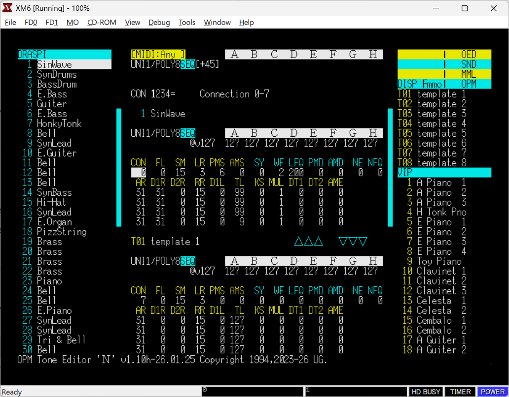

# OPM Tone Editor 'N'

[English](README.md) | [日本語](README.ja.md)

OPM Tone Editor 'N' は、
X68000 上の Human68k で動作する
YM2151（OPM）用の音色編集ツールです。

FM音色編集を、直感的かつレスポンス良く、
効率的に行えるよう設計されています。

---

## Overview

OPM Tone Editor 'N' では、
音を実際に鳴らしながらリアルタイムで音色を編集できます。

---

## Key Features

- **YM2151（OPM）のパラメータを直接編集**
- **2ファイル・2音色データの同時編集**
- **最大200音色をコンテキスト切替なしで扱える**
- **テンプレートスロット（T01～T08）で音色を再利用**
- **編集しながら音をプレビュー可能**
- **編集ロックにより音色を保護**
- **選択マークでエクスポート対象の音色を管理**

---

## Editing Experience

パラメータの変更は即座に反映されます。

編集しながら音の変化をその場で確認できるため、\
各パラメータが音に与える影響を直感的に把握できます。

---

## Interface

編集操作は、操作内容に応じて最適な入力方法に割り当てられています。

- パラメータ編集 → キーボード  
- 選択・操作 → マウス  

これにより、操作の流れを途切れさせることなく、
編集に集中できます。

---

## System Structure

OPM Tone Editor 'N' は編集機能に特化し、
音の再生は独立したモジュール（**scalekey**）が担当します。

この分離により：

- 安定したリアルタイム再生  
- 軽快な編集操作  
- 演奏機能の柔軟な拡張  

が可能になります。

---

## Supported Formats

入力：

- OED, MML, OPM, SND, MDX, ZMS

出力：

- OED, MML, OPM, SND

---

## Documentation

設計思想（rationale）は以下にまとめられています：

- `docs/00_context/rationale/`

システムの構造や設計意図を説明しています。

---

## Status

実装および関連ドキュメントは、
v1.20 のリリース後に公開予定です。

---

## Summary

OPM Tone Editor 'N' は、

- 音を聴きながら編集できるリアルタイム性  
- 既存音色を活用した効率的なワークフロー  
- 無駄を省いた操作体系  

により、音色データを効率良く編集できる環境を提供します。
