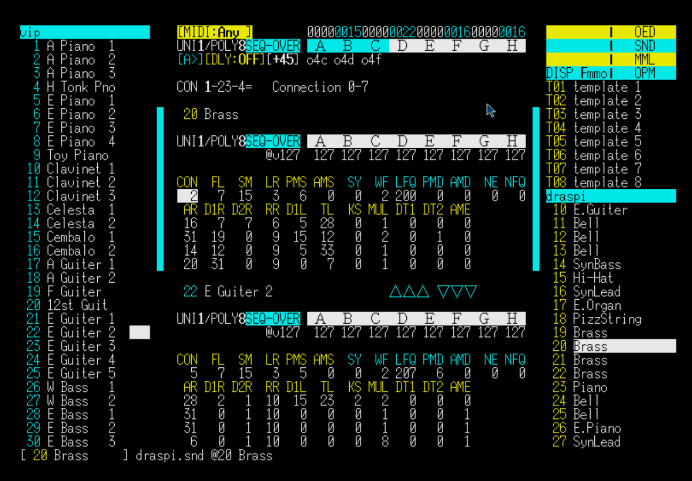

# OPM Tone Editor 'Ｎ'

[English](README.md) | [日本語](README.ja.md)

OPM Tone Editor 'Ｎ' は、X68000 上の Human68k で動作するYM2151（OPM）用の音色編集ツールです。\
FM音色編集を、直感的かつレスポンス良く、効率的に行えるよう設計されています。

---

## Overview

OPM Tone Editor 'Ｎ' では、\
演奏モジュール **scalekey** との連携により、\
編集中の音色を実際に鳴らしながらリアルタイムで編集できます。\
v1.20 では演奏機能が強化され、\
**ユニゾン・ディレイ・ディチューン**を使った、より実際の演奏に近い状態での音色編集が可能です。

---

## Key Features

- **YM2151（OPM）のパラメータを直接編集**
- **2ファイル・2音色データの同時編集**
- **最大200音色をコンテキスト切替なしで扱える**
- **テンプレートスロット（T01～T08）**
- **編集しながら音をプレビュー可能**
- **scalekey 連携による演奏・試聴**（キーボード・MIDI 入力）
- **ユニゾン／ディレイ／ディチューン機能**
- **編集ロックによる音色データ保護**
- **選択マークでエクスポート対象の音色を管理**

---

## Editing Experience

パラメータの変更は即座に反映されます。\
編集しながら音の変化をその場で確認できるため、\
各パラメータが音に与える影響を直感的に把握できます。

パラメータの入力はキーボード、対象の選択はマウスで行います。

---

## System Structure

OPM Tone Editor 'Ｎ' は編集機能に特化し、\
音の再生は独立したモジュール（**scalekey**）が担当します。

この分離により：

- 安定したリアルタイム再生
- 軽快な編集操作
- 演奏機能の柔軟な拡張

が可能になります。

> 演奏機能を利用するには scalekey v1.10 以降が必要です。\
> scalekey は別途配布しています（[scalekey](https://github.com/shimase68000/scalekey)）。

---

## Supported Formats

入力：

- OED, MML, OPM, SND, MDX, ZMS

出力：

- OED, MML, OPM, SND

---

## Installation

Releases から配布アーカイブをダウンロードし、任意の場所に展開してください。\
実行ファイルと同じ場所に設定ファイル `oe.jsn` を置いて起動します。

- [Releases](../../releases)

演奏機能を使う場合は、**scalekey** も入手し、`PATH` の通った場所に展開してください。\
scalekey は別途リリースしています。

- [scalekey](https://github.com/shimase68000/scalekey) / [scalekey Releases](https://github.com/shimase68000/scalekey/releases)

Tone Editor v1.21 は scalekey v1.10 以降と組み合わせて動作します。\
`scalekey.midi_enable` の設定を使う場合は scalekey v1.11 以降が必要です。

---

## Documentation

設計思想（rationale）や仕様の解説は、以下にまとめられています。

- `docs/` … 解説・設計資料
- `docs/rationale/` … システムの構造や設計意図（ユーザー向け）
- `docs/00_context/rationale/` … システムの構造や設計意図（AI・実装者向け）

---

## Source Code

`proj/` に本体のソースコード（`inc/` `src/` `Makefile`）を収めています。\
これは参考公開であり、ビルド環境の詳細な説明は現状では用意していません。\
通常は、Releases の配布アーカイブをご利用ください。

同ディレクトリの `oe.jsn` は、設定ファイルのサンプルを兼ねています。

---

## Summary

OPM Tone Editor 'Ｎ' は、

- 音を聴きながら編集できるリアルタイム性
- 既存音色を活用した効率的なワークフロー
- 無駄を省いた操作体系

により、音色データを効率良く編集できる環境を提供します。

---

## License

This project is released under the MIT License.

Copyright (c) 1994, 2023-2026 UG.
