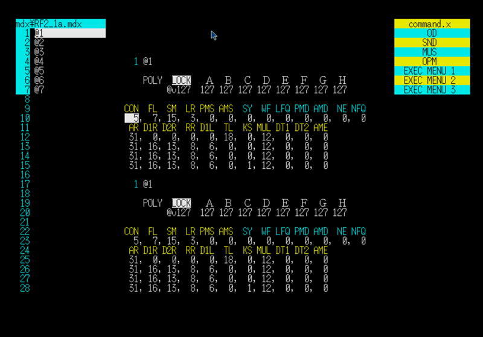

# History — OPM Tone Editor 'N'

## The Founding Concept

Before a single line of code was written, there was a concept:

> All existing tone data is a template for future tones.

This was not a feature requirement. It was a way of thinking about\
what tone editing actually is. You do not create tones from nothing.\
You start from something that exists, modify it, and arrive somewhere new.\
Every tone in your collection is potentially the starting point for the next one.

This idea shaped everything that followed.

---

## How the Layout Was Decided

The first step was to display OPM parameters on screen.

Once that was done, something became visible:\
there was more space than expected.

That observation led directly to the first structural decision:

> If two sets of OPM parameters fit side by side,
> then two tones can be edited in parallel.

And the space on the left and right suggested another:

> If two file lists fit on either side,
> then two files can be open at the same time.

The layout was not designed in advance on paper.\
It emerged from looking at what was already there.

From the start, editing responsibilities were divided by input method:

- OPM parameter editing → keyboard
- Tone selection, channel selection, volume → mouse

The goal was to eliminate unnecessary operations.\
Every switch between input modes is a small interruption.\
The design tried to minimize those interruptions.

---

## The First Attempt, and the Restart

Coding began before the design was fully settled.

At some point it became clear that continuing in that direction\
would cause problems later. The structure was accumulating\
in a way that would be difficult to manage.

Development was stopped.\
The concept was thought through more carefully.\
Then coding started again from scratch.

---

## Version 0.07

The second attempt reached version 0.07:

- a tone list on the left
- an execution menu in the upper right
- two OPM parameter tables in the center
- parameter editing available for the upper table only
- a system message area at the bottom of the screen

One detail in this version is worth noting.\
The area above the parameter tables — the upper center pane —\
was left intentionally empty.

It was not unfinished. It was reserved.\
The note at the time read:\
*"hold space for playback status display or some configuration display."*

That reservation would remain unfulfilled for nearly thirty years.

---

## Shelved in 1996

The year was 1996.

Windows 95 had been released.\
Consumer hardware was approaching 100 MHz.\
The X68000 series — its fastest model running a 68030 at 25 MHz —\
had lost the argument.

The BBS networks that had carried X68000 culture were closing.\
MDX music submissions had nearly stopped.\
The community that would have used a tone editor was dissolving.

In that environment, the motivation to continue could not be sustained.

Version 0.07 was left unfinished.

The reason, stated simply: **it was built too late.**

---

## Preservation

The source code was not deleted.

The contents of the hard disk were transferred to MO discs.

This was possible in part because of another tool built around the same period:\
**MOFORMAT**, an MO disk formatter for the X68000.

MOFORMAT supported not only Human68k format but also IBM format —\
a decision made after seeing a discussion on BBS networks about\
MO disks formatted in IBM format being readable directly on PC/AT systems.\
The addition felt natural at the time: *if it can be done, it should be.*

That decision turned out to matter far more than expected.

When the development environment shifted to Windows,\
the MO discs formatted in IBM format were readable without any conversion.\
The contents of the X68000 hard disk — source code, development tools,\
all the work accumulated through the early 1990s —\
could be transferred to Google Drive in the 2010s\
because the MO discs were in a format that Windows could read.

There was no plan behind this chain of events.\
The IBM format support in MOFORMAT was not added in anticipation of a future Windows environment.\
It was added because someone on a BBS mentioned it was useful,\
and that seemed like a good enough reason.

The source code survived because there was no reason to throw it away,\
and because a formatting decision made in the early 1990s\
happened to bridge two incompatible worlds across thirty years.

---

## What Remained

The software was shelved. The concept was not.

Through the years that followed —\
regardless of platform, regardless of environment —\
the idea of finishing what had been started in 1994 remained.

Not as an obligation. As an intention.

This pattern — holding space for what might be needed later,\
without knowing exactly what form it would take —\
runs through the entire design history.

The upper center pane of v0.07 was left empty,\
not because there was nothing to put there,\
but because something would eventually belong there.

The same instinct shaped every tool in this collection.\
The design does not predict the future.\
It avoids closing off options that the future might need.

---

## Resumed in 2023

In 1996, software emulation of the X68000 was not something anyone anticipated.\
The platform was declining. That seemed final.

What was not anticipated:\
that the platform would be preserved in software,\
that the original development environment would remain intact and buildable,\
that the source code from 1994 would compile and run\
inside an emulator running on modern hardware.

In 2023, development resumed.

The v0.07 source was retrieved.\
The concept that had existed only as intention\
for nearly thirty years was built out.

---

## Version 1.00

Version 1.00 was released in July 2025.

Several things came together in this version.

**The reserved space was used.**\
The upper center pane — left empty in v0.07\
as a placeholder for "playback status or something" —\
became the playback module display.\
The reservation made in 1994 was honored in 2025.

**The template slots were added.**\
T01 through T08 did not exist in v0.07.\
The idea came from a specific question:

> What happens when only one file is open?

When two files are open, copying a tone from one to the other is natural.\
But with a single file, there is no second list to copy from or to —\
no shelf to set something down on while working.

The template slots were the answer.\
A fixed set of eight slots, always present,\
independent of how many files are loaded.

Eight, because eight matched the OPM's eight channels.\
Eight, because more would crowd the screen and fewer felt insufficient.\
The number arrived without forcing.

**The tone count was fixed at 200.**\
This matched the capacity of the SND format —\
the tone format used by SOUND PRO-68K, SHARP's official sound tool for the X68000.\
Interoperability, not arbitrary choice.

**Operator topology was displayed as a glyph.**\
Instead of showing a numeric algorithm ID,\
the editor displayed the connection structure directly —\
a compact ASCII representation of how the operators were wired.\
Users familiar with FM synthesis could read it without explanation.\
This notation later became OTG (OED Operator Topology Glyph),\
formalized as a standalone specification.

**The LOCK mechanism was introduced.**\
Tones could be protected from accidental modification.\
Files could be locked and automatically set read-only after saving.

**The OED format was defined.**\
The storage format grew from a simple container into a designed format:\
fixed binary structure, encoding-aware headers,\
per-tone names and memos, template tone support.\
The founding concept — *all existing tones are templates* —\
was built into the format itself.

---

## Version 1.10

Version 1.10 was released in September 2025.

The playback engine was separated from the editor.

Previously, tone editing and keyboard/MIDI playback\
had lived in the same process.\
In v1.10, playback was extracted into an independent TSR module: **scalekey**.

Tone Editor became focused on editing.\
scalekey became focused on playback.

The separation was not about performance alone.\
It was about clarity of responsibility —\
the same principle that had divided keyboard and mouse operations\
from the very beginning.

---

## Note on the v0.07 Screenshot

A screenshot of version 0.07, taken on 2025-08-08 inside an emulator,\
is preserved alongside this document.

The interface is sparse.\
The template slots are absent.\
The upper center pane is empty, waiting.\
The right side holds only a small execution menu.

But the structure is recognizable:\
the file list on the left, the parameter tables in the center,\
the space on the right waiting to be filled.

The intention is visible, even in an unfinished state.

That is the version that waited thirty years.

---

## Timeline

| Year | Event |
|------|-------|
| 1994 | Development begins. Version 0.07 reached. |
| 1996 | Shelved due to X68000 market collapse. |
| 2010s | Source transferred from MO discs to Google Drive. |
| 2023 | Development resumed. |
| 2025-07 | Version 1.00 released. |
| 2025-08 | Version 1.03 released (critical TL calculation fix). |
| 2025-09 | Version 1.10 released (scalekey separation). |
| 2025– | Version 1.20 in development. Planned close of X68000 phase. |
| After 1.20 | Continuation on Windows platform. |

---

## On the X68000 Phase

When development resumed in 2023,\
the goal was not simply to finish what had been left incomplete.

The X68000 version was conceived from the start as a test case —\
a working implementation on constrained hardware\
that would validate the design before it moved to a wider platform.

In 1996, the aim had been to build a complete X68000 ecosystem.\
That aim changed when development restarted.

The X68000 imposes real constraints:\
limited memory, a single-tasking OS, direct hardware access,\
assembly language where performance matters.\
Building a complete FM tone workstation under these conditions\
is not a compromise. It is a proof.

If the ideas hold up on the X68000,\
they will hold up anywhere.

Version 1.20 is intended as the close of this phase.\
Not because the X68000 no longer matters,\
but because what needed to be validated on this platform\
will have been validated.

The ecosystem — OPM Tone Editor, scalekey, OED, OTG —\
will continue on Windows,\
carrying the same philosophy\
that was proven on the platform where it began.
